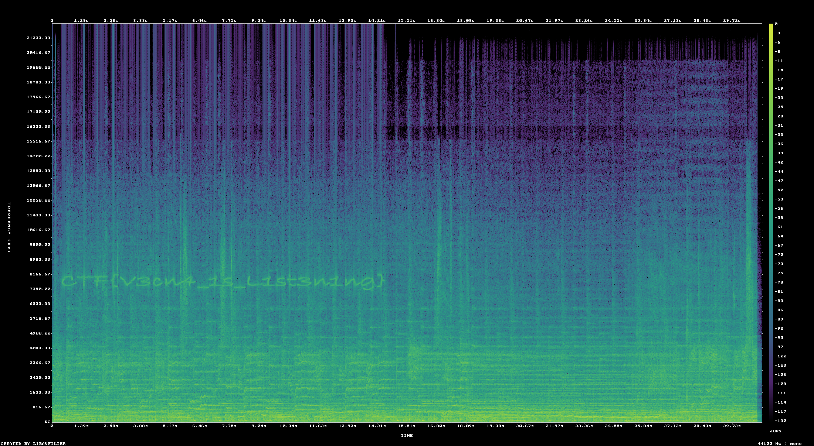

## Challenge

- Competition: [UpSideCTF](https://upsidectf.online/challenges)
- Challenge: `The Max Mayfield Tape`
- Category: `Forensics`
- Points: `75`

## Reconstruction Note

This post is reconstructed from the local Codex session log and the challenge artifacts stored in this workspace.

Prompt snapshot: Challenge The Max Mayfield Tape 0 0 Max was listening to her favorite song on loop to keep Vecna out of her mind. However, we intercepted her walkman and noticed a strange, high-pitched anomaly in the background of the track. What is Vecna's message? SAVE MAX!!! (Cost: 15 points)



## Solve Path

1) Category detection

- `misc` / audio stego, high confidence.
- Evidence: rendering the WAV as a spectrogram reveals text embedded around the 7.3 to 8.2 kHz band.

2) Attack strategy

- Minimal hypothesis: the “high-pitched anomaly” is spectrogram text rather than audible speech or metadata.
- Validation: generate a full spectrogram, then zoom the suspicious frequency band for readability.

3) Execution steps

```powershell
ffmpeg -y -i "`Downloads/cursed_tape.wav`" -lavfi "showspectrumpic=s=1920x1080:legend=1:scale=log:color=viridis" "cursed_tape_spectrogram.png"
```

- The full spectrogram showed hidden text.
- A tighter STFT render of `7300-8200 Hz` over the first `15s` made it readable as:
  `CTF{V3cn4_1s_L1st3n1ng}`

4) FLAG

`CTF{V3cn4_1s_L1st3n1ng}`

5) Writeup

- The anomaly is spectrogram steganography embedded in the audio.
- Once visualized, the hidden message is directly readable; no further decoding was needed.
